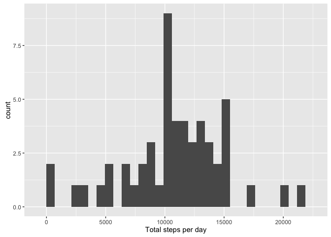
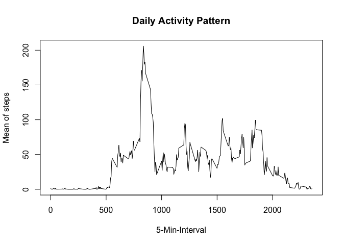
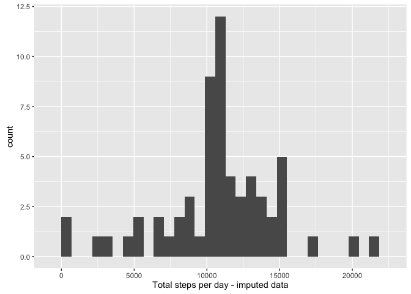
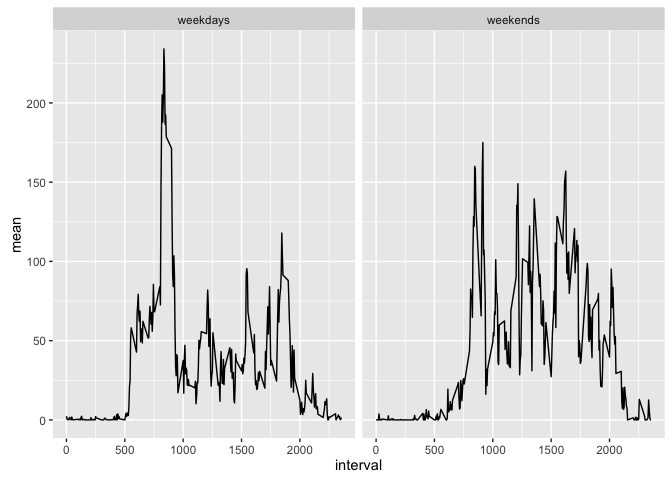

# Reproducible Research: Peer Assessment 1


## Loading and preprocessing the data
1. Load the data (i.e. `read.csv()`)

```r
# set your working directory to new repo and load the data
unzip("activity.zip")
activity <- read.csv("activity.csv")
```
2. Process/transform the data (if necessary) into a format suitable for your analysis

```r
# preprocessing of Date
activity$date <- as.Date(activity$date)
head(activity)
```

```
##   steps       date interval
## 1    NA 2012-10-01        0
## 2    NA 2012-10-01        5
## 3    NA 2012-10-01       10
## 4    NA 2012-10-01       15
## 5    NA 2012-10-01       20
## 6    NA 2012-10-01       25
```

```r
str(activity)
```

```
## 'data.frame':	17568 obs. of  3 variables:
##  $ steps   : int  NA NA NA NA NA NA NA NA NA NA ...
##  $ date    : Date, format: "2012-10-01" "2012-10-01" ...
##  $ interval: int  0 5 10 15 20 25 30 35 40 45 ...
```
## What is mean total number of steps taken per day?
For this part of the assignment, you can ignore the missing values in
the dataset.

```r
#remove NAs
activityNA<-activity[which(!is.na(activity$steps)),]
```
1. Make a histogram of the total number of steps taken each day

```r
# group by Day using dplyr and summarise
library(dplyr)
```

```
## Warning: package 'dplyr' was built under R version 3.2.2
```

```
## 
## Attaching package: 'dplyr'
```

```
## The following objects are masked from 'package:stats':
## 
##     filter, lag
```

```
## The following objects are masked from 'package:base':
## 
##     intersect, setdiff, setequal, union
```

```r
by_dateNA <- group_by(activityNA, date)
total <- summarise(by_dateNA,total = sum(steps))
# histogram for total steps using ggplot (and save as png)
library(ggplot2)
```

```
## Warning: package 'ggplot2' was built under R version 3.2.3
```

```r
qplot(total$total, xlab='Total steps per day')
```

```
## `stat_bin()` using `bins = 30`. Pick better value with `binwidth`.
```



```r
dev.copy(png, file="histogramNA.png", height=480, width=480)
```

```
## quartz_off_screen 
##                 3
```

```r
dev.off()
```

```
## quartz_off_screen 
##                 2
```
2. Calculate and report the **mean** and **median** total number of steps taken per day

```r
# calculate and report mean
meanNA<-mean(total$total)
meanNA
```

```
## [1] 10766.19
```

```r
# calculate and report median
medianNA<-median(total$total)
medianNA
```

```
## [1] 10765
```
## What is the average daily activity pattern?
1. Make a time series plot (i.e. `type = "l"`) of the 5-minute interval (x-axis) and the average number of steps taken, averaged across all days (y-axis)

```r
# group by Interval using dplyr and summarise to plot
by_interval<- group_by(activityNA, interval)
mean_interval <- summarise(by_interval,mean = mean(steps))
# time series plot of mean interval (and save it)
plot(mean_interval$interval,mean_interval$mean,type = "l", xlab = "5-Min-Interval", main = "Daily Activity Pattern", ylab = "Mean of steps")
```



```r
dev.copy(png, file="time_series.png", height=480, width=480)
```

```
## quartz_off_screen 
##                 3
```

```r
dev.off()
```

```
## quartz_off_screen 
##                 2
```
2. Which 5-minute interval, on average across all the days in the dataset, contains the maximum number of steps?

```r
max_step<-mean_interval$interval[which.max(mean_interval$mean)]
max_step
```

```
## [1] 835
```

```r
#look at the result like x:xx, the interval is each 5 minutes
```
## Imputing missing values
Note that there are a number of days/intervals where there are missing values (coded as `NA`). The presence of missing days may introduce bias into some calculations or summaries of the data.

1. Calculate and report the total number of missing values in the dataset (i.e. the total number of rows with `NA`s)

```r
sum(is.na(activity))
```

```
## [1] 2304
```

```r
sum(is.na(activity$steps))
```

```
## [1] 2304
```

```r
sum(is.na(activity$date))
```

```
## [1] 0
```

```r
sum(is.na(activity$interval))
```

```
## [1] 0
```

```r
# there are missing values in steps variable
```
2. Devise a strategy for filling in all of the missing values in the dataset. The strategy does not need to be sophisticated. For example, you could use the mean/median for that day, or the mean for that 5-minute interval, etc.

```r
# use the mean for each interval across all days
# we can use 'mean_interval' recently created
mean_NA<-mean_interval$mean
interval_NA<-mean_interval$interval
mean_NA<-as.array(mean_NA)
row.names(mean_NA)<-interval_NA
head(mean_NA)
```

```
##         0         5        10        15        20        25 
## 1.7169811 0.3396226 0.1320755 0.1509434 0.0754717 2.0943396
```
3. Create a new dataset that is equal to the original dataset but with the missing data filled in.

```r
# create a new data.frame
activity_imputed<-activity
# use mean_NA to assign interval mean to each missing value
activity_imputed[which(is.na(activity_imputed$steps)),1]<-
mean_NA[as.character(activity_imputed[which(is.na(activity_imputed$steps)),3])]
```
4. Make a histogram of the total number of steps taken each day and Calculate and report the **mean** and **median** total number of steps taken per day. Do these values differ from the estimates from the first part of the assignment? What is the impact of imputing missing data on the estimates of the total daily number of steps?

```r
# group by Day using dplyr and summarise
by_date <- group_by(activity_imputed, date)
total_noNA <- summarise(by_date,total = sum(steps))
# histogram for total steps using ggplot (and save as png)
qplot(total_noNA$total, xlab='Total steps per day - imputed data')
```

```
## `stat_bin()` using `bins = 30`. Pick better value with `binwidth`.
```



```r
dev.copy(png, file="histogram_noNA.png", height=480, width=480)
```

```
## quartz_off_screen 
##                 3
```

```r
dev.off()
```

```
## quartz_off_screen 
##                 2
```

```r
# calculate and report mean
mean_noNA<-mean(total_noNA$total)
mean_noNA
```

```
## [1] 10766.19
```

```r
meanNA
```

```
## [1] 10766.19
```

```r
# calculate and report median
median_noNA<-median(total_noNA$total)
median_noNA
```

```
## [1] 10766.19
```

```r
medianNA
```

```
## [1] 10765
```
## Are there differences in activity patterns between weekdays and weekends?
For this part the `weekdays()` function may be of some help here. Use the dataset with the filled-in missing values for this part.
1. Create a new factor variable in the dataset with two levels -- "weekday" and "weekend" indicating whether a given date is a weekday or weekend day.

```r
# create weekdays variable
activityNA$days<-weekdays(activityNA$date)
activityNA$week<-as.factor(c("weekends", "weekdays"))
# change week variable if days are during the week or the weekend
activityNA[activityNA$days == "Sunday" | activityNA$days == "Saturday" ,5]<- factor("weekends")
activityNA[!(activityNA$days == "Sunday" | activityNA$days == "Saturday") ,5]<- factor("weekdays")
tabWeek<- table(activityNA$days, activityNA$week)
tabWeek
```

```
##            
##             weekdays weekends
##   Friday        2016        0
##   Monday        2016        0
##   Saturday         0     2016
##   Sunday           0     2016
##   Thursday      2304        0
##   Tuesday       2592        0
##   Wednesday     2304        0
```
2. Make a panel plot containing a time series plot (i.e. `type = "l"`) of the 5-minute interval (x-axis) and the average number of steps taken, averaged across all weekday days or weekend days (y-axis).

```r
# group by Interval using dplyr and summarise to plot
by_intervalW<- group_by(activityNA, interval, week)
mean_intervalW<- summarise(by_intervalW,mean = mean(steps, na.rm = TRUE))
```

```r
# time series plot of mean interval (and save it)
g<-ggplot(mean_intervalW, aes(interval, mean))
g+geom_line()+facet_grid(.~week)
```



```r
dev.copy(png, file="time_series_week.png", height=480, width=480)
```

```
## quartz_off_screen 
##                 3
```

```r
dev.off()
```

```
## quartz_off_screen 
##                 2
```

